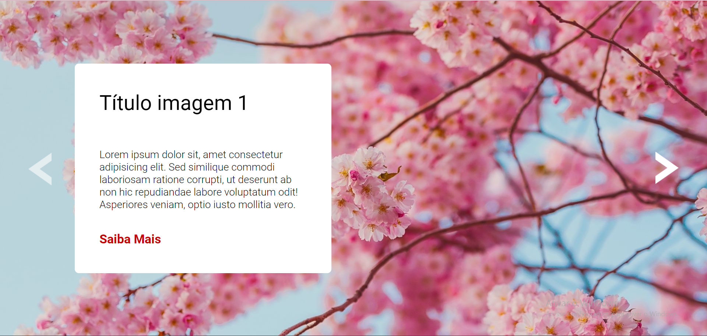

# Carrossel de Imagens

Desafio realizado durante o módulo de JavaScript intermediário - no curso DevQuest.

## Objetivos:

- Visualizar o layout ideal para a página, dependendo do tamanho da tela do dispositivo;
- Consiga passar e voltar as imagens quando quiser

### Tecnologias

- HTML
- CSS
- JavaScript

### Desktop Preview

### Mobile Preview

